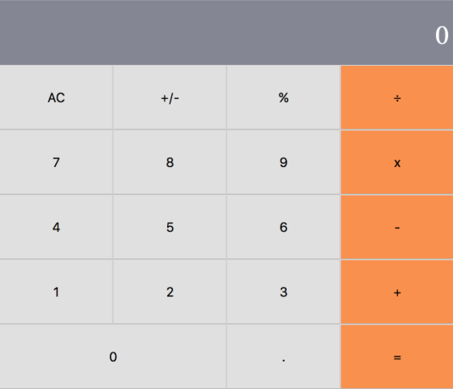

# React Calculator
Building a calculator for Math-magicians Inc bootstrapped with [Create React App](https://github.com/facebook/create-react-app). This product would assist them with their calculations.

# Live Demo

> Click [here](https://mminc-calc.herokuapp.com/) for live demo



## Built With
- React
- Node.js
- React-Create-App
- npm
- CSS
- ES6
- eslint
- style lint

## Getting Started

### Prerequisites
  * Git
  * npm
  * Node.js
  * IDE (Intergrated Development Enviroment)
  * Web Browser

### Steps
- From the command line/terminal clone the repository

```
$ git clone https://github.com/Elbie-em/React-Calculator.git
```

**Available Scripts**

cd into the project directory, and you can run:

```
$ npm install

Installs on dependencies
```

```
$ npm start

Runs the app in the development mode.<br />
Open [http://localhost:3000](http://localhost:3000) to view it in the browser.

The page will reload if you make edits.<br />
```

## Author

👤 **Elbie Moonga**

- GitHub: [@Elbie-Em](https://github.com/Elbie-em)
- Twitter: [ElbieEm](https://twitter.com/ElbieEm)
- LinkedIn: [elbie-moonga](https://www.linkedin.com/in/elbiemoonga/) 

## 🤝 Contributing

Contributions, issues and feature requests are welcome!

Feel free to check the [issues page]().

## Show your support

Give a ⭐️ if you like this project!

## Acknowledgments

- [Microverse](microverse.org)

## Learn More

You can learn more in the [Create React App documentation](https://facebook.github.io/create-react-app/docs/getting-started).

To learn React, check out the [React documentation](https://reactjs.org/).

## 📝 License

This project is [MIT](./license.md) licensed.